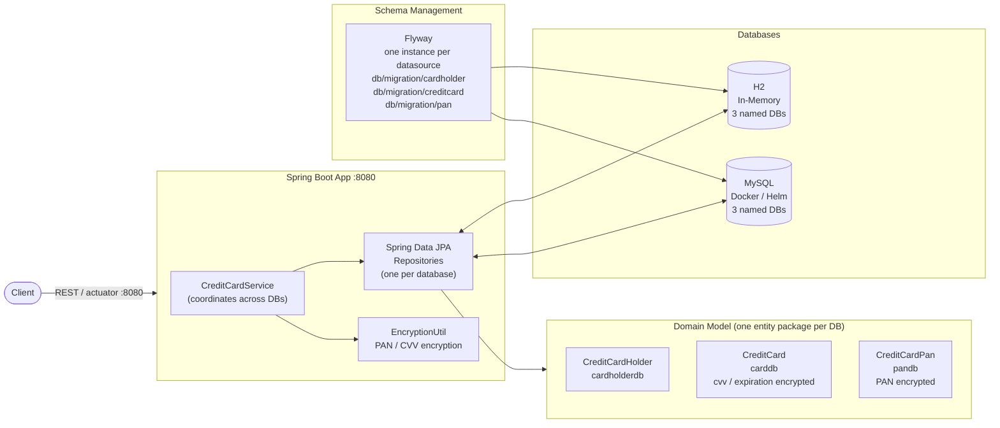
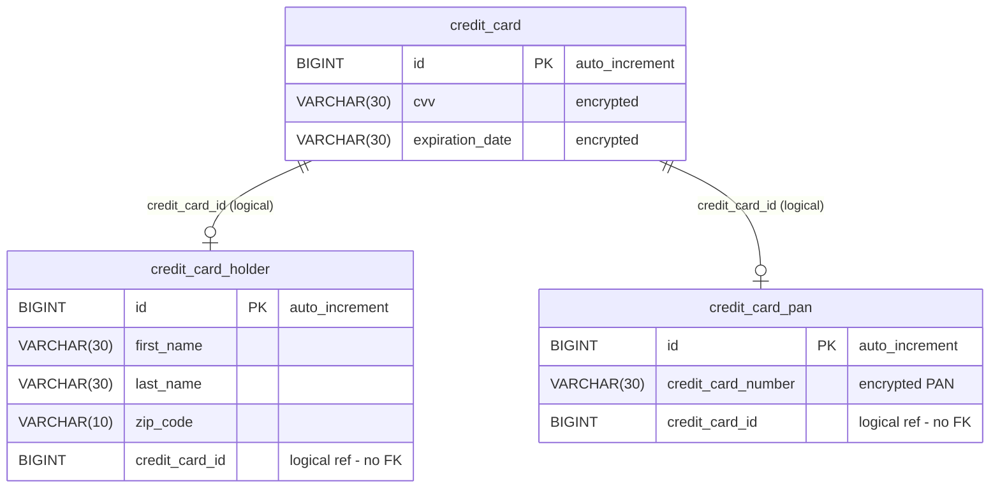

# Spring Data JPA Multiple Database Project

Spring Boot 4 / Spring Data JPA demo project on **Java 25** (enforced by the maven-enforcer plugin),
demonstrating three independent databases in one application — `cardholderdb`, `carddb` and `pandb` —
each with its own datasource configuration, entities, repositories and Flyway migrations, running
against in-memory H2 or MySQL. A service layer coordinates the databases; PAN, CVV and expiration
date are encrypted at rest. Deployment is via Docker image and Helm chart.

## Multi-Database Configuration

This project is configured to work with three separate databases:

1. Credit Card Holder Database
2. Credit Card Database
3. Credit Card PAN (Primary Account Number) Database

Each database is configured independently, allowing for separate connection details, migration scripts, and entity management.

## Architecture Overview



## Database Schema

The three tables live in three independent databases: the `credit_card_id` columns are logical
references (no physical FKs across database boundaries), coordinated by `CreditCardService`.



## Flyway

The `mysql` profile enables Flyway out of the box (`application-mysql.yaml`): each datasource runs its own
migrations from `db/migration/{cardholder,creditcard,pan}`. MySQL is started automatically via the
spring-boot-docker-compose integration using `compose-mysql.yaml` (port 3306) — no property overrides needed.

## Docker

The Docker Compose file `compose-mysql.yaml` mounts the startup script `src/scripts/init-mysql.sql`,
which creates the three databases (`cardholderdb`, `carddb`, `pandb`) and their users.

## Kubernetes

### Deployment with Helm

Be aware that we are using a different namespace here (not default).

Go to the directory where the tgz file has been created after `./mvnw clean install`

```powershell
cd target/helm/repo
```

unpack

```powershell
$file = Get-ChildItem -Filter sdjpa-multi-db-chart-*.tgz | Select-Object -First 1
tar -xvf $file.Name
```

install

```powershell
$APPLICATION_NAME = Get-ChildItem -Directory | Where-Object { $_.LastWriteTime -ge $file.LastWriteTime } | Select-Object -ExpandProperty Name
helm upgrade --install $APPLICATION_NAME ./$APPLICATION_NAME --namespace sdjpa-multi-db --create-namespace --wait --timeout 8m --debug --render-subchart-notes
```

show logs

```powershell
kubectl get pods -n sdjpa-multi-db
```

replace $POD with pods from the command above

```powershell
kubectl logs $POD -n sdjpa-multi-db --all-containers
```

Show Endpoints

```powershell
kubectl get endpoints -n sdjpa-multi-db
```

test

```powershell
helm test $APPLICATION_NAME --namespace sdjpa-multi-db --logs
```

status

```powershell
helm status $APPLICATION_NAME --namespace sdjpa-multi-db
```

uninstall

```powershell
helm uninstall $APPLICATION_NAME  --namespace sdjpa-multi-db
```

delete all

```powershell
kubectl delete all --all -n sdjpa-multi-db
```

create busybox sidecar

```powershell
kubectl run busybox-test --rm -it --image=busybox:1.36 --namespace=sdjpa-multi-db --command -- sh
```

You can use the actuator rest calls (`restRequest/actuator.http`) to verify the app via port 30080

## Running the Application

1. Choose between h2 or mysql for database schema management. (you can use one of the preconfigured intellij runners)
2. Start the application with the appropriate profile and properties.
3. The application will use Docker Compose to start MySQL and apply the database schema changes.

## Sandbox (local dev environment)

The sandbox is provisioned by the opencode-sandbox-kit and runs as a Docker container. It mounts this
repo, starts the agent, and connects the IntelliJ MCP server. The app runs on port `8080`; `compose-mysql.yaml`
provides MySQL.

Allow the kit source (GitHub without cloning):

```powershell
sbx settings set kit.allowedSources --% "[\"docker.io/\",\"github.com/dboeckli/\"]"
```

Start a new sandbox:

```powershell
sbx run opencode `
    --kit "git+https://github.com/dboeckli/opencode-sandbox-kit.git#dir=opencode-agent" `
    --template docker.io/domboeckli/sbx-opencode-tooling:latest `
    --skills=off `
    --static-mcp idea `
    . `
    "C:\development\maven-repo:ro"
```

Start the sandbox with Kubernetes support:

```powershell
sbx run opencode `
    --kit "git+https://github.com/dboeckli/opencode-sandbox-kit.git#dir=opencode-agent" `
    --template docker.io/domboeckli/sbx-opencode-tooling:latest `
    --skills=off `
    --static-mcp idea `
    . `
    "C:\development\maven-repo:ro" `
    "$env:USERPROFILE\.kube:ro"
```

Claude Code (Home) and Mammouth Code variants:

```powershell
sbx run claude `
    --kit "git+https://github.com/dboeckli/opencode-sandbox-kit.git#dir=opencode-agent" `
    --template docker.io/domboeckli/sbx-claude-tooling:latest `
    --skills=off `
    --static-mcp idea `
    . `
    "C:\development\maven-repo:ro"
```

```powershell
sbx run "git+https://github.com/dboeckli/opencode-sandbox-kit.git#dir=mammouth-agent" `
    --kit-arg imageTag=latest `
    --skills=off `
    --static-mcp idea `
    . `
    "C:\development\maven-repo:ro"
```

### Start the app

Start MySQL (H2 needs no Docker):

```shell
docker compose -f compose-mysql.yaml up
```

Then run one of the IntelliJ run configurations (`.run/Spring6Application h2.run.xml` or the MySQL
one) or start via `./mvnw spring-boot:run -Dspring-boot.run.profiles=h2`.

### Sandbox build quirk

The sandbox mounts the repo via filesystem passthrough, which blocks symlinks — Spotless's `npm install`
(prettier) would fail with `EPERM` unless npm skips bin links. The kit sets `npm_config_bin_links=false`
globally, so no manual export is needed.
